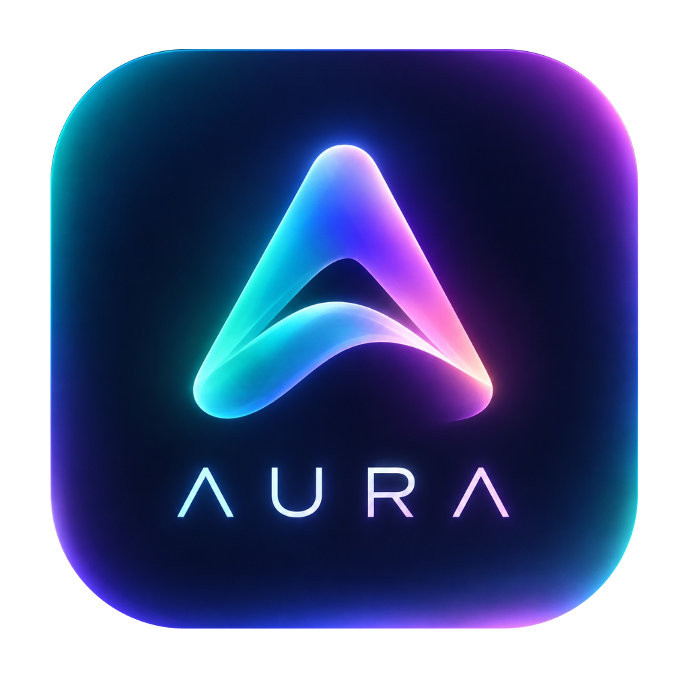

# Λ U R Λ (Aura for macOS)

<p align="center">
  
</p>

<p align="center">
  <strong>Native Ambient Music Visualizer & Intelligent Desktop Companion for macOS</strong><br>
  <em>SwiftUI • AppKit • AVFoundation • Accelerate (vDSP FFT) • WidgetKit • CoreImage • macOS Keychain</em>
</p>

<p align="center">
  
  
  
  
  
</p>

---

### Language / Язык
- [English Documentation](#english)
- [Русская документация](#русский)

---

<a name="english"></a>
# English

## Overview

**Aura** is a lightweight, ultra-responsive, completely native music companion and ambient visualizer for macOS. Engineered without web views, Electron, or external dependencies, Aura harnesses Apple's hardware-accelerated frameworks (**Accelerate vDSP**, **Metal/CoreImage**, **AVFoundation**, and **WidgetKit**) to deliver an immersive audio-visual experience while maintaining minimal CPU and battery usage.

Whether you are listening through **Spotify**, **Apple Music**, or playing **local lossless audio files** (FLAC, WAV, AIFF, M4A, MP3), Aura seamlessly captures playback telemetry, analyzes audio frequencies, projects reactive perimeter Ambilight glow, adapts desktop wallpapers, and provides sleek desktop and menu bar interfaces.

---

## Key Features

- **⚡ Hardware-Accelerated Audio Reactivity**: Real-time spectral analysis powered by Apple Accelerate `vDSP` FFT for local files, official Spotify Cloud Beat-Grid sync, and adaptive smart rhythm tracking.
- **✨ Perimeter Ambilight Edge Glow**: Dynamic neon light waves along your screen bezels synchronized with track BPM and a vibrant 4-color palette extracted from album art.
- **🖼️ Dynamic Multi-Monitor Wallpapers**: Generates atmospheric blurred desktop and lock screen backgrounds matching the playing track, with automatic restoration upon pause or quit.
- **🪟 Desktop Overlay & Floating Mini-Player**: Borderless interactive desktop widget anchored beneath icons (spinning vinyl, floating 3D card), compact always-on-top glass mini-player, and menu bar extra.
- **📱 macOS Notification Center Widget**: Standalone WidgetKit extension displaying large high-resolution artwork and playback telemetry on your lock screen and widget panel.
- **🎵 Last.fm Scrobbling & Secure Keychain**: Official Last.fm 2.0 scrobbling with offline queuing and encrypted credential storage in macOS Keychain.
- **🔋 High Performance & Battery Friendly**: 100% native Swift/SwiftUI with zero web wrappers or Electron; dynamic frame rate governance (60 $\to$ 30 $\to$ 15 FPS) to conserve MacBook battery.

---

## Technical Architecture

```
native/Aura/
├── Package.swift                    # SPM manifest (macOS 14+, Swift 5.9+)
├── Info.plist                       # Bundle metadata, Apple Events usage descriptions, strict TLS
├── Aura.entitlements                # Sandboxed entitlements & AppleScript automation access
├── build.sh                         # Multi-target release builder, codesigning & DMG packager
├── Resources/                       # Icons, AURA cover fallback art, DMG background
└── Sources/
    ├── AuraWidget/                  # macOS Notification Center Extension (WidgetKit)
    │   ├── AuraWidget.swift         # Widget timeline provider, SwiftUI layout & app group sync
    │   └── Info.plist               # Widget extension bundle manifest
    └── Aura/
        ├── App.swift                # @main entry point, NSApplicationDelegate, global hotkeys
        ├── Models.swift             # Source, Effect, Atmosphere, SavedPreset, Appearance models
        ├── Theme.swift              # Adaptive Design System tokens (Dark / Light / Accent)
        ├── MusicController.swift    # Core state coordinator & facade connecting all services
        │
        ├── LocalAudioService.swift        # AVAudioEngine player with PCM mixer tap
        ├── AudioAnalysisService.swift     # vDSP FFT 1024-point processor, Beat-Grid & BPM tracker
        ├── PlayerAutomationService.swift  # Swift Actor: async AppleScript IPC for Spotify & Apple Music
        ├── WallpaperManager.swift         # Multi-monitor CoreImage wallpaper compositor & restoration
        ├── DesktopOverlayManager.swift    # Transparent desktop window anchored at kCGDesktopWindowLevel
        ├── NotchGeometryHelper.swift      # Hardware-accurate MacBook camera notch & capsule geometry
        ├── NotchOverlayManager.swift      # Ambient notch halo, audio wings & Dynamic Island HUD overlay
        ├── ColorExtractor.swift           # Hardware-accelerated k-means palette extraction & HSB booster
        ├── ArtworkFetcher.swift           # High-resolution artwork resolver (Spotify CDN, Deezer, iTunes)
        ├── LastFMService.swift            # Last.fm 2.0 API client, offline cache & MD5 signing
        ├── KeychainHelper.swift           # Secure macOS Keychain wrapper
        ├── PerformanceManager.swift       # IOKit battery telemetry, thermal throttling & FPS regulator
        ├── WindowCloseHandler.swift       # Clean window lifecycle without interrupting background audio
        │
        └── Views/
            ├── ContentView.swift          # Main dashboard, sidebar navigation & detailed settings
            ├── EdgeGlowView.swift         # Real-time Ambilight perimeter glow with BPM wave motion
            ├── NotchGlowView.swift        # Dynamic Notch glow halo, visualizer wings & interactive HUD
            ├── AtmosphereView.swift       # Generative audio atmosphere & 21-band EQ visualizer
            ├── CoverView.swift            # Fullscreen immersive artwork stage
            ├── MiniPlayerView.swift       # Floating always-on-top glass player
            ├── MenuBarView.swift          # Menu bar extra popover view
            └── LastFMView.swift           # Last.fm account connection & session controls
```

---

## System Requirements

- **Operating System**: macOS 14.0 (Sonoma) or macOS 15.0+ (Sequoia)
- **Architecture**: Apple Silicon (M1 / M2 / M3 / M4, arm64 only)
- **Supported Players**: Spotify (Free & Premium), Apple Music, or Local Audio files (MP3, M4A, FLAC, WAV, AIFF)
- **Build Requirements**: Xcode 15+ or Xcode Command Line Tools (`swift --version` $\ge 5.9$)

---

## Installation

### Option 1: Download Pre-built DMG (Recommended)

1. Download the latest **[Aura.dmg](https://github.com/kodzyfox/AURA/releases/latest/download/Aura.dmg)** from [Releases](https://github.com/kodzyfox/AURA/releases).
2. Open the downloaded `Aura.dmg` installer.
3. Drag **Aura** into your **Applications** folder.
4. Launch Aura from Applications or Spotlight.
5. When prompted, allow AppleEvents automation permissions for **Spotify** or **Apple Music** to enable playback sync and artwork detection.

> [!TIP]
> **First Launch on macOS**: If macOS Gatekeeper displays a warning regarding an unidentified developer, right-click `Aura.app` $\to$ select **Open**, or navigate to **System Settings** $\to$ **Privacy & Security** and click **Open Anyway**.

### Option 2: Build from Source

Requirements: macOS 14+ on Apple Silicon, Xcode Command Line Tools (`xcode-select --install`).

```bash
git clone https://github.com/kodzyfox/AURA.git
cd AURA
./build.sh
```
The compiled application and DMG will be ready in `native/Aura/dist/`.

---

## Global Hotkeys & Shortcuts

| Shortcut | Action |
|:---|:---|
| `Space` | Play / Pause |
| `⌘ + Right Arrow` | Next Track |
| `⌘ + Left Arrow` | Previous Track |
| `⌘ + Up Arrow` | Increase Volume |
| `⌘ + Down Arrow` | Decrease Volume |
| `⌘ + F` | Toggle Fullscreen Cover Mode |
| `⌘ + M` | Toggle Floating Mini-Player |
| `Esc` | Exit Fullscreen Mode |

---

<a name="русский"></a>
# Русский

## Описание проекта

**Aura** — полностью нативный, легковесный и ультра-отзывчивый музыкальный компаньон и генеративный амбиентный визуализатор для macOS. Разработан без Electron, веб-обёрток и сторонних зависимостей. Aura задействует аппаратные фреймворки Apple (**Accelerate vDSP**, **Metal/CoreImage**, **AVFoundation** и **WidgetKit**), создавая глубокий аудиовизуальный эффект при минимальном потреблении ресурсов процессора и аккумулятора.

Aura поддерживает **Spotify**, **Apple Music** и **локальные аудиофайлы высокого разрешения** (FLAC, WAV, AIFF, M4A, MP3). Приложение в реальном времени синхронизирует воспроизведение, проводит спектральный анализ звука, освещает края монитора переливающимся Ambilight-свечением, адаптирует обои рабочего стола под палитру обложки и предлагает стильные виджеты для рабочего стола и строки меню.

---

## Ключевые возможности

- **⚡ Аппаратная аудио-реактивность**: Мгновенный спектральный анализ звука через Apple Accelerate `vDSP` FFT (для локальных FLAC/WAV/MP3), синхронизация с ритмом Spotify Beat-Grid и адаптивная сетка темпа.
- **✨ Периметральное Ambilight-свечение**: Динамическая неоновая подсветка краев монитора в такт музыке с интеллектуальной палитрой из цветов текущей обложки.
- **🖼️ Динамические обои для всех мониторов**: Автоматическая генерация кинематографичных размытых обоев под цвет альбома с бесследным возвратом ваших стандартных обоев при паузе.
- **🪟 Оверлей рабочего стола и мини-плеер**: Интерактивный виджет на рабочем столе под иконками (крутящийся винил, парящая 3D-обложка), компактный плавающий стеклянный плеер поверх всех окон и иконка в строке меню.
- **📱 Виджет для Центра уведомлений**: Нативное расширение на WidgetKit с крупной обложкой и статусом трека на панели виджетов и экране блокировки.
- **🎵 Скробблинг Last.fm и связка ключей**: Поддержка официального протокола Last.fm с офлайн-очередью и шифрованием учетных данных в системной связке ключей macOS Keychain.
- **🔋 Максимальная энергоэффективность**: 100% нативный Swift/SwiftUI без веб-обёрток и Electron; динамическая регулировка FPS для экономии заряда аккумулятора MacBook.

---

## Архитектура кодовой базы

Проект спроектирован по модульному шаблону на базе независимых сервисов и акторов (Swift Concurrency / Swift 6 Ready):
- `MusicController` — единый реактивный фасад для SwiftUI.
- `LocalAudioService` — движок воспроизведения локальных аудиофайлов на базе `AVAudioEngine`.
- `AudioAnalysisService` — аппаратный спектральный анализ через Apple Accelerate `vDSP`.
- `PlayerAutomationService` — фоновый Swift Actor с асинхронным AppleScript IPC для Spotify и Apple Music.
- `WallpaperManager` — композитинг многомониторных обоев на базе CoreImage и управление экраном блокировки.
- `DesktopOverlayManager` — прозрачный виджет на уровне рабочего стола macOS.
- `ColorExtractor` — быстрый k-means кластеризатор палитры и HSB-компенсатор насыщенности.
- `ArtworkFetcher` — многоканальный резолвер обложек высокого разрешения.
- `LastFMService` — клиент Last.fm 2.0 с MD5-подписью запросов и офлайн-очередью.
- `PerformanceManager` — мониторинг питания, термо-менеджмент и адаптивный регулятор FPS.

---

## Системные требования

- **Операционная система**: macOS 14.0 (Sonoma) или macOS 15.0+ (Sequoia)
- **Архитектура процессора**: Только Apple Silicon (M1 / M2 / M3 / M4, arm64)
- **Поддерживаемые плееры**: Spotify (Free / Premium), Apple Music, либо локальные файлы (FLAC, MP3, M4A, WAV, AIFF)
- **Инструменты для сборки**: Xcode 15+ или Xcode Command Line Tools (`swift --version` $\ge 5.9$)

---

## Инструкция по установке

### Способ 1: Готовый образ DMG (Рекомендуется)

1. Скачайте свежий установочный образ **[Aura.dmg](https://github.com/kodzyfox/AURA/releases/latest/download/Aura.dmg)** со страницы [Releases](https://github.com/kodzyfox/AURA/releases).
2. Откройте загруженный файл `Aura.dmg`.
3. Перетащите иконку **Aura** в папку **«Программы» (Applications)**.
4. Запустите приложение через Spotlight или Launchpad.
5. При первом запуске разрешите управление через AppleEvents для **Spotify** или **Apple Music** для синхронизации музыки и обложек.

> [!TIP]
> **Первый запуск в macOS**: Если система сообщает о неидентифицированном разработчике, нажмите по приложению правой кнопкой мыши $\to$ **Открыть**, либо откройте **Системные настройки** $\to$ **Конфиденциальность и безопасность** и нажмите **«Подтвердить вход» / «Открыть»**.

### Способ 2: Сборка из исходников

Требования: macOS 14+ на Apple Silicon, Xcode Command Line Tools (`xcode-select --install`).

```bash
git clone https://github.com/kodzyfox/AURA.git
cd AURA
./build.sh
```
Собранное приложение и установочный образ появятся в папке `native/Aura/dist/`.

---

## Горячие клавиши

| Сочетание | Действие |
|:---|:---|
| `Пробел` | Воспроизведение / Пауза |
| `⌘ + Вправо` | Следующий трек |
| `⌘ + Влево` | Предыдущий трек |
| `⌘ + Вверх` | Увеличить громкость |
| `⌘ + Вниз` | Уменьшить громкость |
| `⌘ + F` | Полноэкранный режим обложки |
| `⌘ + M` | Плавающий мини-плеер |
| `Esc` | Выход из полноэкранного режима |

---

## Лицензия / License

**AURA Proprietary License (All Rights Reserved) / Проприетарная лицензия (Все права защищены)**  
Copyright © 2024–2026 [Kodzy](https://github.com/kodzyfox).

- **English**: Personal, non-commercial use only. Any modification, patching, decompilation, redistribution, sublicensing, or creation of derivative works without prior express written permission from the author is strictly prohibited. Full legal terms: [LICENSE](LICENSE).
- **Русский**: Программа предназначена исключительно для личного некоммерческого использования. Любая модификация, декомпиляция, внесение изменений, повторное распространение или создание производных продуктов без явного предварительного письменного согласия автора строго запрещены. Полный текст лицензии: [LICENSE](LICENSE).
